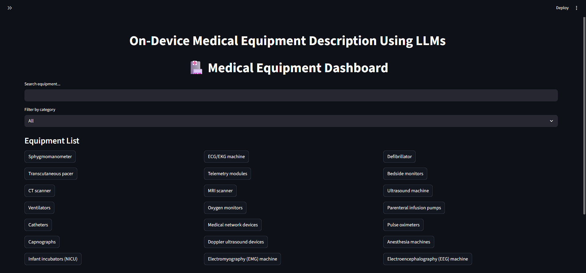
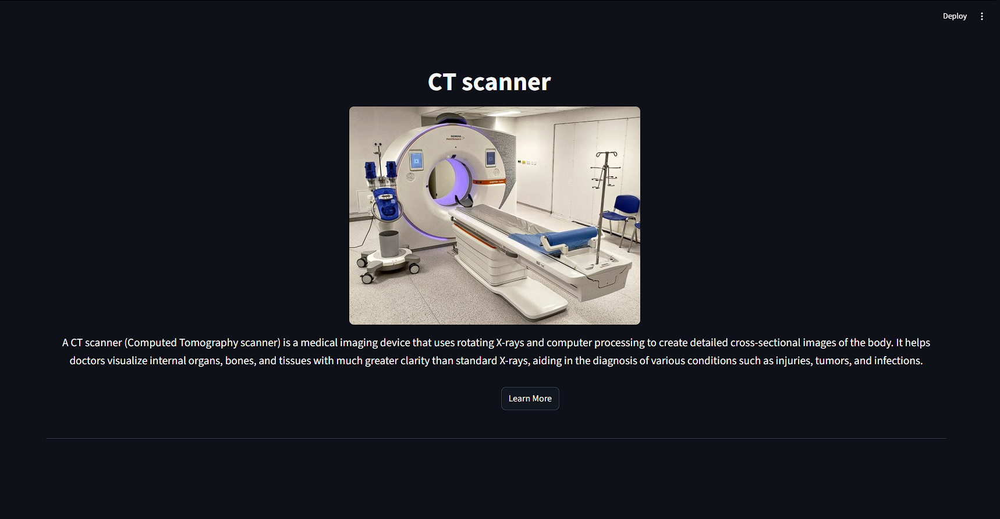
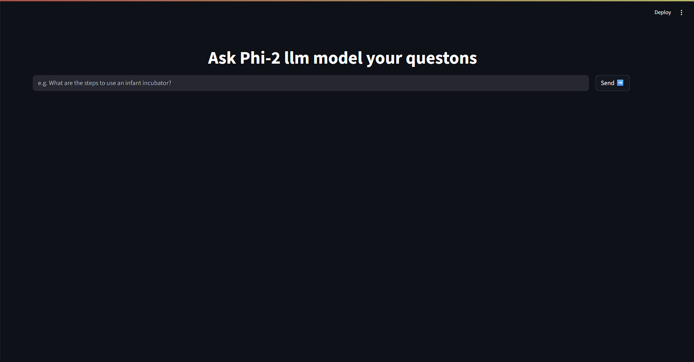
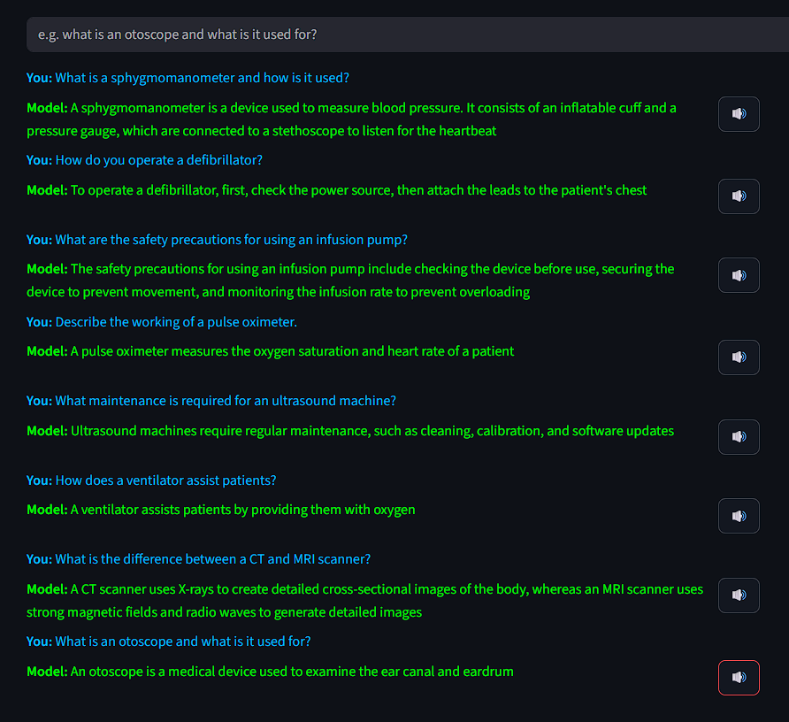

---

```markdown
# On-Device Medical Equipment Description Using LLMs

**Developed by Devansh Kapadia**

---

## 📝 Project Overview

This project presents an **offline desktop application** that leverages a fine-tuned Large Language Model (LLM) to provide comprehensive descriptions and interactive Q&A for a wide range of medical equipment. The application is designed to assist healthcare professionals, technicians, and students by offering instant, reliable, and private access to equipment information—**even without an internet connection**.

The app features a modern, multi-page Streamlit interface, searchable equipment dashboard, detailed equipment pages with images, and a chat interface supporting text input. The LLM is fine-tuned on a custom dataset of medical equipment Q&A, ensuring relevant and accurate responses.

---

## 🎯 Aim

- To develop an **on-device application** that delivers detailed, offline descriptions and interactive Q&A support for medical equipment.
- To enhance equipment literacy, operational efficiency, and safety in healthcare environments, especially where internet access is limited or unavailable.

---

## 💡 Use Cases

- **Healthcare professionals** needing quick reference or troubleshooting for medical devices.
- **Technicians** seeking step-by-step guidance on equipment operation or maintenance.
- **Medical students** learning about various devices and their applications.
- **Hospitals/clinics** in remote or resource-limited areas requiring offline access to equipment information.

---

## 🚀 Features

- **Searchable dashboard** of medical equipment
- **Equipment detail pages** with images and comprehensive descriptions
- **Chat/Q&A interface** for equipment-specific queries 
- **Text-to-speech** for answers, enhancing accessibility
- **Offline functionality** after initial setup

---

## 📦 Setup Instructions

### 1. Clone the Repository

```bash
git clone https://github.com/devansh280904/Medical_Equipment_llm.git
cd Medical_Equipment_llm
```

### 2. Download the Model File

- [Download the model from Google Drive](https://drive.google.com/file/d/1Xij_B6B0VrXQNW5SIrmJiP-voL44nhid/view?usp=sharing)
- Place the downloaded file in the `models/` directory:
  ```
  models/phi2-medical-merged-q8.gguf
  ```

### 3. Install Requirements

```bash
pip install -r requirements.txt
```

### 4. Run the App

```bash
streamlit run app.py
```

---

## 🖼️ Screenshots

| Dashboard | Equipment Details | Chat/Q&A |Results |
|-----------|------------------|----------|----------|
|  |  |  |  |

---

## 📝 Notes

- The main product is designed for local use, but an online preview/demo may be available.
- For best results, use the recommended model and follow the directory structure.

---

## 📚 Credits

Made by Devansh Kapadia

---

## 📄 License

[MIT License](LICENSE)

